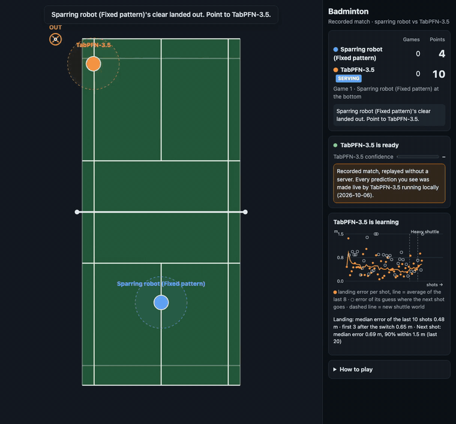
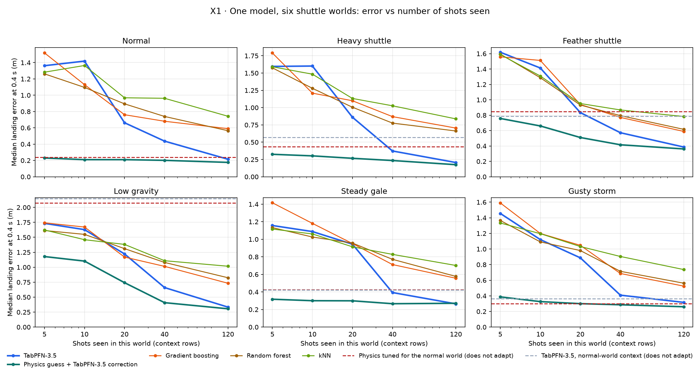

# TabPFN-3.5 for live play: a badminton bot that adapts while it plays

For the TabPFN-3.5 Hackathon I built a badminton-playing bot that runs on TabPFN-3.5 in real time. It plays singles in the browser against a human, or against a sparring robot, and every prediction behind its decisions comes from TabPFN-3.5. There's no other model in the loop.



**Try it without installing anything:** [chandanreddy10.github.io/tabpfn-badminton-bot](https://chandanreddy10.github.io/tabpfn-badminton-bot/) plays a recorded match in your browser. Every prediction you see was made live by TabPFN-3.5, and it's replayed without a server. There's also an [80-second video](https://chandanreddy10.github.io/tabpfn-badminton-bot/demo.mp4) of the same match. The demo is a single file, [`demo/index.html`](demo/index.html), which you can also download and open directly.

Playing badminton is mostly a series of small prediction problems, made under time pressure, and each one fits naturally into a table:
- where is this shot going to land,
- how will my body move if I push this way,
- which shot should I play back,
- and where is the other player likely to hit next?

The bot keeps a table for each of these, filled with what has happened so far in the match. Whenever it needs an answer it hands the table to TabPFN-3.5 and gets back a prediction with a range. A planner then turns those answers, and how unsure they are, into movement.

There is no physics engine inside the bot and no model trained on the game. It never played badminton before the warm-up, and everything it knows it learns during the match from a few dozen examples. You can also change the shuttle mid-match (feather, heavy, low gravity, a storm), and the bot has to notice from the shots alone.


## Why this matters

Most machine learning works as train, then deploy. You collect data, fit a model, ship it, and hope the world stays the way it was. Live systems don't work like that. The floor gets slippery, the wind picks up, a part wears out, a different person starts using the machine. Something that acts in the real world has to keep up while it's running, usually from very little data, and it has to know when it isn't sure.

That's what this project is really about. Badminton is just a convenient place to test it: it's fast, noisy and partly hidden (the bot never sees the wind), and the rules can change mid-match. In that setting TabPFN-3.5 does four things that matter for any live system:

- **Learning becomes adding a row.** Every shot, landing and step the bot takes goes into a table, and the very next prediction already uses it. There's no training run, no retraining schedule and no hyperparameters to retune when things change. The model is always the same; only the context changes.
- **It adapts to changing dynamics.** The same model, with no task-specific code, learns three different kinds of dynamics while playing:
  - **How the shuttle flies:** in six different worlds, it gets to 0.21–0.39 m landing error after about 120 shots, roughly half the error of gradient boosting, random forest or kNN on the same data.
  - **How its own body moves:** it relearns after the court turns slippery.
  - **How a particular opponent plays:** it learns where they tend to hit next.

  When the world switches without warning, it settles again in 14–22 shots.
- **Its uncertainty is good enough to act on.** The planner only commits to a movement if TabPFN's ranges say it will reach the shuttle with at least 90% probability. That only works if those ranges are honest, and they were: 91–94% coverage in every world, with the tightest intervals of any model I tried. Gradient boosting's ranges held only 64–72% of the time, which would make an agent take risks it shouldn't.
- **It works from the first minute.** About 30 practice shots are enough to start playing. A model that needs thousands of examples before it's useful can't run live.

Running a model like this in a live loop also means dealing with latency. A TabPFN call takes 1–4.5 seconds on my laptop, while the game runs at 120 steps per second. The patterns I used to make that work aren't specific to badminton:
- **Never wait on the model:** the controller keeps acting on its last plan while a prediction is in flight.
- **Batch the questions:** one call returns a 625-point grid of movement predictions that the planner can query thousands of times.
- **Ask urgent questions first:** landing and shot choice jump ahead of background work.
- **Degrade safely:** follow the last plan, then stop. The bot never quietly switches to a different method.

I think the same loop could apply well beyond games. That loop is: learn the dynamics from a few dozen live examples, predict with calibrated uncertainty, plan against that uncertainty, and keep updating. I haven't tested any of these, but the problem has the same shape:
- a robot on changing floors or terrain,
- a drone in gusty wind,
- an exoskeleton adjusting to one person's gait,
- a training machine that adapts to an athlete,
- a process controller whose plant drifts over time,
- a game character that learns how each player actually plays.

The honest limits are speed (this suits decisions on the scale of a second, or a loop that queries a batched surrogate) and the first handful of examples in a brand-new situation. Starting from a rough physics guess and letting TabPFN learn the correction fixed most of the slow start in my experiments.

## Playing against it fairly

The best way to judge a bot like this is to play it, so I tried hard to make the match fair and not give the bot anything a human doesn't have.

- **Same body.** Both players move with the same physics: the same top speed, acceleration, reach and court. If you change the speed, grip or input delay in the settings, it changes for both sides.
- **Same eyes, or slightly worse.** The bot sees nothing you can't see on screen: where both players are and where the shuttle is. You see the shuttle move smoothly, while the bot only gets its position every 50 ms, with a bit of noise added. It never sees the wind, the random part of a shot, or where the shuttle is going to land. It finds out where a shot landed only after it lands, same as you.
- **Same rules for hitting.** Both players can only hit a shuttle that lands within reach, and both have the same two seconds to choose a shot and a target.
- **No homework.** TabPFN-3.5 isn't trained on this game. Before the first match the bot watches about 20 practice shots and hits 10 of its own, and everything after that it learns during play.
- **Nobody is told when the rules change.** If you switch to a feather shuttle or low gravity mid-match, the bot isn't told. It has to notice from the shots, just like you.

There are two places where I adjusted things on purpose, and both are visible in the settings:

- **Slower bot shots.** By default, shots from the bot to the human take 3 times longer to arrive (1–4× in the settings). They land on exactly the same spot; you just get more time to react. A person needs a few hundred milliseconds to see a shot and start moving, and this evens that out.
- **Slow motion while TabPFN thinks.** A TabPFN prediction takes 1–4.5 seconds on my laptop, which is far slower than a person's reaction. So while the bot is waiting on an answer that matters, the whole game runs in slow motion for both players. You can turn this off in the settings if you want to see what happens without it.

## Running it

```
python3.13 -m venv .venv && source .venv/bin/activate
pip install -r requirements.txt
cp .env.example .env        # put your TABPFN_TOKEN in here
python server.py            # then open http://localhost:8000
```

You can get a token at https://platform.priorlabs.ai/account/api-keys. You don't need API access to play. By default TabPFN-3.5 runs on your own machine, and the first time it runs, the server downloads the TabPFN-3.5 weights (about 876 MB) from Hugging Face. That needs a one-time licence acceptance, which the same token takes care of. Loading then takes around 40 seconds, and the start screen says when TabPFN is ready.

The start screen has three modes:

- **Play vs TabPFN-3.5.** You, the human, against the bot. You start at the bottom. Move with WASD, pick a shot with 1 (clear), 2 (drop) or 3 (smash), then click where you want it to land. Press H at any time for the rules.
- **Watch TabPFN-3.5 learn.** TabPFN plays a sparring robot with a fixed playing style while the shuttle world changes every few rallies. Good if you want to watch it adapt without playing.
- **Two players, one keyboard.** Human vs human, no TabPFN.

## What I found



To check whether TabPFN-3.5 can really keep up when conditions change, I ran it outside the game too. I tried six shuttle worlds, sudden unannounced switches between them, and six scripted players with different habits. The full write-up is in [experiments/REPORT.md](experiments/REPORT.md). In short:

- After about 120 shots in a world, its median landing error was 0.21–0.39 m in all six worlds. Gradient boosting, random forest and kNN trained on the same rows ended up at roughly twice that.
- It starts slowly. With only 5–10 shots it's no better than those models. Letting it correct a simple physics guess fixes most of that, at least offline.
- After an unannounced switch it needs 14–22 shots to settle again. Adding a "how many shots ago" column to each row helped, so the game now does that.
- It learned where the scripted players would hit next and what shot they'd play. Against a random player it correctly learned nothing.
- When it said it was 90% sure, it was right 91–94% of the time, in every world. That matters because the bot uses those numbers to decide whether it can reach a shot.

The weak spots are the first few shots in a new world, the shots right after a change, and speed.

## How the bot thinks

The bot keeps four small tables, each a sliding window over recent play. Whenever it needs an answer it sends the table and the new row to TabPFN-3.5 and gets back a prediction with a range.

| Question | What a row contains | What TabPFN predicts |
|---|---|---|
| Where will this shot land? | time since the hit, shuttle positions seen so far, its velocity, shot type, both players' positions, how many shots ago | offset from the last seen position, and the remaining flight time |
| How will I move? | position, velocity, current and previous command | change in velocity over 0.1 s |
| Which shot should I play? | shot type, my position, target, distance, game time, my recent miss | how far the shot will land from where I aimed |
| Where will the human hit next? | where they hit from, my position, their last shot, rally shot number | where their next shot lands |

- **Landing:** it asks at 0.2, 0.4 and 0.6 seconds after the human hits.
- **Movement:** a planner tries 48 possible movement plans over the next 1.2 seconds. It simulates each one 8 times using TabPFN's movement predictions and uncertainty, and picks a plan that reaches the shuttle with at least 90% probability. Asking TabPFN at every simulated step would be far too slow, so the planner uses a grid of 625 TabPFN predictions that it refreshes every few seconds.
- **Shot choice:** it tries 24 random shots and picks the one most likely to land in and be hard to reach.
- **Next-shot guess:** this only draws a marker on the court ("TabPFN-3.5 expects your next shot here"). It doesn't change how the bot plays.

In this mode every prediction has to come from TabPFN. Each answer is tagged with its source and anything else is rejected. The comparison models I used while building it (kNN, filters, gradient boosting and so on) live in `web/dev-tools.js`, which the game doesn't load unless you open the developer panel. The tests check that answers from those models are refused.

If TabPFN is slow, the bot keeps following its last plan and then stops. If there's no answer for 5 seconds the game pauses with a Retry button; watch mode retries by itself.

## Things to try

- **Shuttle world** (next to the court): normal, heavy shuttle, feather shuttle, low gravity, steady gale and gusty storm. A change applies from the next rally. You can also have it switch automatically every 5 or 10 rallies.
- **Learning chart:** a small chart shows how far off TabPFN's landing guesses were, shot by shot, with a line at each world change.
- **Slippery court:** makes both players slide, and the bot has to relearn how it moves.
- **Replay:** replays the last point exactly.
- **Themes:** there are four colour themes.
- **Developer details:** shown by default (call counts, timing, calibration, and a panel with the comparison models). Open `/?dev=0` for a clean view, or `/?start=bot` to skip the start screen.

## Running TabPFN locally or through the API

By default the server runs TabPFN-3.5 on your own machine with the open weights from [Prior-Labs/tabpfn_3_5](https://huggingface.co/Prior-Labs/tabpfn_3_5). It picks an NVIDIA GPU if there is one, then Apple's GPU, then the CPU.

`python server.py --backend api` uses Prior Labs' hosted API instead, pinned to TabPFN-3.5. That costs about 10k tokens per call and allows at most 60 calls a minute, which adds up quickly over a match.

If the API isn't available, the game doesn't stop. That covers no token, quota or rate limit reached, or the network being down. TabPFN-3.5 is then downloaded directly from Hugging Face and runs locally on your machine instead, and the rest of the match continues on the same model. The switch takes around 30–40 seconds the first time while the model loads (plus the one-time download). The game pauses briefly during that and then carries on. If there's no token at all, the one-time licence acceptance for the download opens in your browser instead. If you'd rather it waited for the API, set `TABPFN_FALLBACK=none` in `.env`.

You can also pick `--model v3.5-fast`, which is about four times faster, or the experimental multiclass version. The model can be switched mid-match from the dropdown.

On my M3 MacBook with TabPFN-3.5 on the GPU, a landing prediction takes about 1.2 s, the movement grid 4.5 s and a shot choice 1.2 s. Urgent requests go first. Settings live in `.env`; see `.env.example`.

## What's in the repo

```
server.py                 game server and TabPFN inference
web/badminton.html        the game, the bot, the planner and the in-browser tests
web/dev-tools.js          comparison models used during development (not used in play)
tests/run_selftest.js     headless tests
experiments/              the experiments behind the report
demo/                     the recorded match (index.html), the video and the GIF
tools/                    scripts that record a match and build the demo, the video and the GIF
docs/                     the original project brief and an example of the bot's landing table
```

Run the tests with:

```
node tests/run_selftest.js                      # the game and the bot
.venv/bin/python tests/test_server_fallback.py  # the API-to-local fallback (fakes the API failures)
```

To redo the experiments (about half an hour on an M3; TabPFN answers are cached, so an interrupted run picks up where it stopped):

```
node experiments/adaptation/gen_adapt.js --seeds 2
.venv/bin/python experiments/adaptation/run_adapt.py --device mps --n-estimators 4
.venv/bin/python experiments/adaptation/analyze_adapt.py
```

## How the demo is made

The game can record itself. During a live match it saves the starting state, every player's actions, each shuttle-world switch, and everything the bot showed on screen (its landing estimate, its next-shot guess, its confidence and the learning chart). The simulator is deterministic, so replaying the recorded actions reproduces the match exactly, and the recorded TabPFN-3.5 outputs are shown at the same moments. The replay needs no server, no Python and no token.

```
python server.py --port 8765                           # local TabPFN-3.5
node tools/record_demo.js --warm 10 --rec 10           # play and record (about 20 minutes)
node tools/build_demo.js                               # demo/index.html with the recording inside
node tools/render_video.js --width 1920 --height 1080 --seconds 30 --speed 1   # a video clip, rendered frame by frame
tools/make_gif.sh 43 13                                # demo/demo.gif for this README, cut from demo/demo.mp4
```

## Known issues

- **Movement uncertainty is too narrow.** The bot's 90% movement ranges hold only about 57% of the time in play. The movement grid is built at one spot on the court, ignores the delay between commands, and doesn't count its own interpolation error.
- **Urgent requests can still wait.** A 4.5-second movement-grid request can't be interrupted, so a landing request that arrives just after it has to wait. Using TabPFN-3.5-Fast for the grid would probably help.
- **The physics-plus-TabPFN combination isn't in the game yet.** It's what fixes the slow start in a new world, but it would break the TabPFN-only rule.
- **Next-shot guesses need a long session:** roughly 10–15 minutes against one playing style before they're useful.
- **Shot choice only looks one shot ahead.**
- **The experiments use the game's own simulator and scripted players,** and real people are a lot less predictable.

## Licence

The code is MIT licensed. The TabPFN-3.5 weights aren't included. They're downloaded from Hugging Face under Prior Labs' own licence, which allows research and evaluation but not commercial use.
