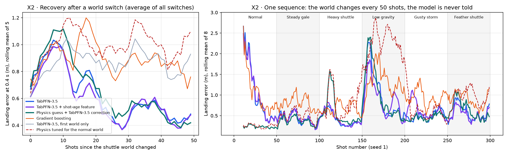
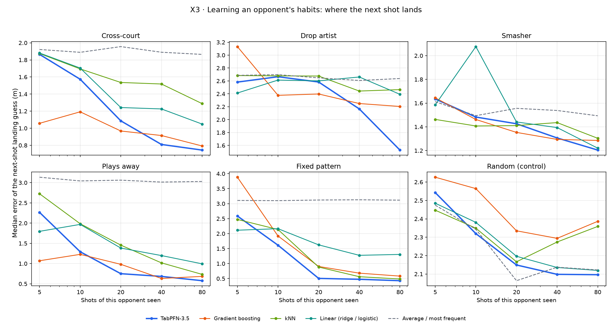
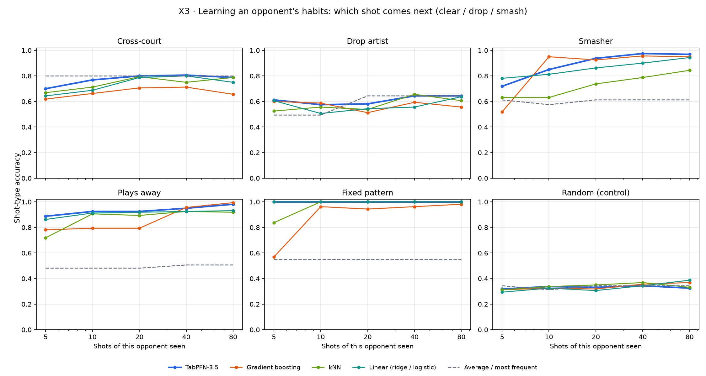
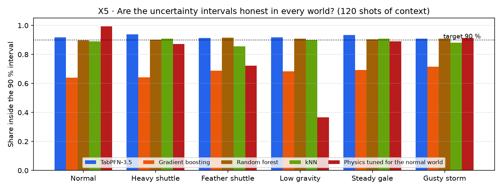

# Can TabPFN-3.5 keep up when the world changes?

The bot in this game predicts everything with TabPFN-3.5, looking at a table of what has happened in the match so far. That raised an obvious question: what happens when the conditions change halfway through? A heavier shuttle, lower gravity, a storm, or simply a different opponent. The model is never retrained and never told that anything changed. Does it notice and adjust, and how quickly?

I tested three things:

1. how well it learns six different "shuttle worlds" from scratch,
2. how it copes when the world switches without warning,
3. whether it can pick up an opponent's habits.

I also checked whether its uncertainty estimates stay trustworthy through all of this, because the bot's planner leans on them heavily.

## Summary

TabPFN-3.5 adapted to every world I gave it. After about 120 shots its landing predictions were off by 0.21–0.39 m (median), roughly half the error of gradient boosting, random forest or kNN trained on the same rows. Its uncertainty was the most reliable of all the models I tried.

It isn't fast to start, though. With 5–10 shots it's no better than anything else, and right after a sudden change it needs 14–22 shots to settle down again. Two small changes helped: giving it a rough physics guess to correct, and telling it how old each row is. The second one is now in the game.

## How I set it up

All the data comes from the game's own simulator. Flights slow down with drag, there's a seeded wind field with gusts, landings have some noise, and the bot only sees noisy shuttle positions every 50 ms. I built the training rows with the same code the bot uses during play, so the experiments see exactly what the bot sees.

The six worlds are scaled versions of the normal physics:

| World | What's different |
|---|---|
| Normal | nothing |
| Heavy shuttle | flies faster and flatter, hardly affected by wind (flight time ×0.8, wind drift ×0.4) |
| Feather shuttle | slower, drifts a lot, stalls early (time ×1.3, drift ×2.2, noisier landings) |
| Low gravity | long, high, floaty flights (time ×1.6, height ×1.8) |
| Steady gale | 2.5× the wind, no gusts |
| Gusty storm | 1.5× the wind, 2.5× the gusts |

The bot is never told which world it's in. It keeps seeing the normal world's timing rules, so the only way to learn the new world is from the shots themselves.

The task in the first two experiments is the one the bot faces most often. 0.4 seconds after the opponent hits, it predicts where the shuttle will land from 18 numbers: the positions seen so far, the shuttle's velocity, the shot type, and where both players are.

I compared:
- TabPFN-3.5 (local weights, 4 ensemble members to keep it quick),
- gradient boosting, random forest and kNN on the same rows,
- the game's simple timing-and-drag physics, tuned for the normal world,
- TabPFN given only normal-world shots (so it can't adapt),
- a combination where the physics makes a guess and TabPFN predicts the correction.

Everything was run with 2 random seeds, and the ranges in brackets are 95% bootstrap intervals. In total this took 478 TabPFN calls, about 27 minutes on an M3 MacBook.

## Learning a new world from scratch


| World | Physics (tuned for normal) | TabPFN after 5 / 20 / 120 shots | Physics + TabPFN after 5 / 20 / 120 | Gradient boosting after 20 / 120 |
|---|---|---|---|---|
| Normal | 0.24 | 1.36 / 0.66 / 0.21 | 0.23 / 0.21 / 0.18 | 0.76 / 0.59 |
| Heavy shuttle | 0.44 | 1.60 / 0.86 / 0.21 | 0.32 / 0.27 / 0.17 | 1.10 / 0.70 |
| Feather shuttle | 0.85 | 1.62 / 0.83 / 0.39 | 0.76 / 0.51 / 0.36 | 0.94 / 0.59 |
| Low gravity | 2.07 | 1.73 / 1.22 / 0.33 | 1.18 / 0.74 / 0.31 | 1.17 / 0.73 |
| Steady gale | 0.42 | 1.16 / 0.94 / 0.26 | 0.32 / 0.30 / 0.27 | 0.95 / 0.56 |
| Gusty storm | 0.30 | 1.46 / 0.89 / 0.32 | 0.39 / 0.30 / 0.26 | 1.05 / 0.52 |

*Median landing error in metres.*

Given enough shots, TabPFN beat the normal-world physics everywhere except the gusty storm, where the two are level (0.32 vs 0.30 m). The physics does fine in the normal world but falls apart in low gravity (2.07 m). TabPFN that had only ever seen normal-world shots didn't do any better than the physics.

The early part of the curve is less flattering. With 5 or 10 shots, TabPFN is no better than the other models. In the normal world it needs about 120 shots just to match the physics, which is not surprising given 18 inputs and a handful of examples.

The physics + TabPFN combination largely removes that problem. From the fifth shot it already beats the physics in four worlds and matches it in the normal world. It's only behind in the storm, and it catches up there by 20 shots. With 120 shots it's the most accurate model in five of the six worlds.

## When the world changes without warning



Here I played 300 shots in a row and changed the world every 50 shots, without telling anyone. Every model was refitted every 10 shots on the last 120.

| Model | First 20 shots after a switch | Once settled (shots 30–49) | Shots to settle |
|---|---|---|---|
| TabPFN + "shots ago" column | 0.77 (0.69–0.85) | 0.51 (0.46–0.55) | 14 |
| TabPFN as it was in the game | 0.82 (0.73–0.93) | 0.51 (0.46–0.56) | 22 |
| Physics + TabPFN | 0.90 (0.80–1.01) | 0.48 (0.43–0.53) | 22 |
| TabPFN, first world only | 0.88 | 0.89 | doesn't adapt |
| Gradient boosting | 0.97 | 0.84 | – |
| Physics (tuned for normal) | 1.02 | 1.03 | doesn't adapt |

*Mean error in metres. "Shots to settle" counts until the rolling error stays within 20% of its settled level.*

Right after a switch, TabPFN is still working from shots that came from the old world, so it's wrong for a while. The fix I tried is simple. Each row in the table also gets a number saying how many shots ago it happened, and the shot being predicted gets 0. That lets TabPFN work out for itself that recent rows matter more. Compared shot for shot, it cut the error after a switch by 0.055 m (−0.101 to −0.008) and changed nothing once things had settled (−0.003, −0.035 to +0.029). I had decided beforehand to keep it only if both of those held, so it's now part of the game.

The physics + TabPFN combination does worse straight after a switch (+0.073 m, +0.015 to +0.132). Its physics guess is wrong in the new world, and its old corrections take a while to wash out. Once settled, it's slightly better than TabPFN alone.

One caveat: refitting only every 10 shots makes recovery look slower than it is in the game, which refits after every landing.

## Learning an opponent's habits




For this one I wrote six scripted opponents:
- one who always plays cross-court,
- one who loves drop shots,
- one who smashes whenever they're close to the net,
- one who hits away from the bot,
- one who repeats a four-shot pattern,
- one who plays completely at random.

Before each shot, TabPFN guessed where it would land (regression) and what kind of shot it would be (classification).

| Opponent | Error after 20 shots: TabPFN / best other | Error after 80 shots: TabPFN / best other | Shot type after 80 |
|---|---|---|---|
| Hits away | 0.75 / 0.98 (gradient boosting) | 0.58 / 0.68 (gradient boosting) | 98% |
| Fixed pattern | 0.51 / 0.88 (kNN) | 0.43 / 0.49 (kNN) | 100% |
| Cross-court | 1.09 / 0.97 (gradient boosting) | 0.74 / 0.79 (gradient boosting) | 79% |
| Drop shots | 2.58 / 2.40 (gradient boosting) | 1.53 / 2.20 (gradient boosting) | 64% |
| Smasher | 1.43 / 1.35 (gradient boosting) | 1.20 / 1.22 (linear) | 97% |
| Random | 2.15 / 2.06 (average) | 2.10 / 2.12 (average) | 32% |

After 80 shots TabPFN had the best guess, or close to it, for every opponent. The biggest gap was with the drop-shot player, who mixes two different plans. Earlier on, with 20 shots or fewer, gradient boosting was sometimes ahead.

The shot-type numbers need some context:
- **Fixed pattern (100%):** kNN and the linear model got that too, so it isn't special.
- **Cross-court (79%) and drop shots (64%):** about what you'd get by always guessing the most common shot.
- **Random opponent:** TabPFN didn't invent patterns. It stayed at the average and got 32% of shot types right, which is chance.

## Are the uncertainty estimates trustworthy?



| Model | Share inside its 90% interval | Average interval width |
|---|---|---|
| TabPFN | 91–94% in every world | 0.73–1.30 m |
| Random forest | 90–92% | 1.77–2.55 m |
| kNN | 86–91% | 2.30–3.19 m |
| Gradient boosting | 64–72% | 1.39–1.94 m |
| Physics (tuned for normal) | 37% (low gravity) to 99% | 1.48 m |

This matters more than it might look. The bot's planner uses these intervals to decide whether it can reach the shuttle with 90% probability, so intervals that are too narrow make it overconfident. TabPFN was the only model whose intervals were both right and tight in every world. Random forest was also right, but with intervals about twice as wide. With the opponents, TabPFN's intervals held 88–94% of the time, against 56–78% for gradient boosting.

## What changed in the game

A few things came straight out of this:
- **The landing model** now includes the "shots ago" column.
- **Shuttle worlds:** you can pick one, or have them switch automatically every 5 or 10 rallies.
- **A small chart** shows the bot's landing error shot by shot, with a line at every world switch.
- **Next-shot guess:** the bot now marks on the court where it expects your next shot to land. That's the opponent experiment running live, and it doesn't affect how the bot plays.
- **Watch mode:** the bot plays a sparring robot with one of the six styles, at up to 4× speed.

I let watch mode run for 8 minutes with local TabPFN on the M3. Nothing was rejected, it never paused, and most predictions took 1.3–2 seconds. The landing error went from 2.7 m to around 0.8–1.0 m, which is about what the first experiment predicts after 20–30 shots. The next-shot guesses need a lot longer, roughly 10–15 minutes against one style.

## Limitations

- **Simulated conditions:** the worlds are scaled versions of the game's own physics, and the opponents follow simple rules. Real players are messier.
- **Small runs:** I used 2 seeds and 4 ensemble members to keep the runs short. The game itself uses TabPFN's default ensemble size.
- **Speed:** TabPFN took 0.85 s per call (median) in these runs, and 1.2–4.5 s in the game. A physics formula takes microseconds.
- **The physics + TabPFN combination isn't in the game:** it uses a non-TabPFN input, and I've kept the game TabPFN-only so far.

## Reproducing

From the repository root:

```
node experiments/adaptation/gen_adapt.js --seeds 2
.venv/bin/python experiments/adaptation/run_adapt.py --device mps --n-estimators 4
.venv/bin/python experiments/adaptation/analyze_adapt.py
```

TabPFN answers are cached, so a second run only redoes what changed.
